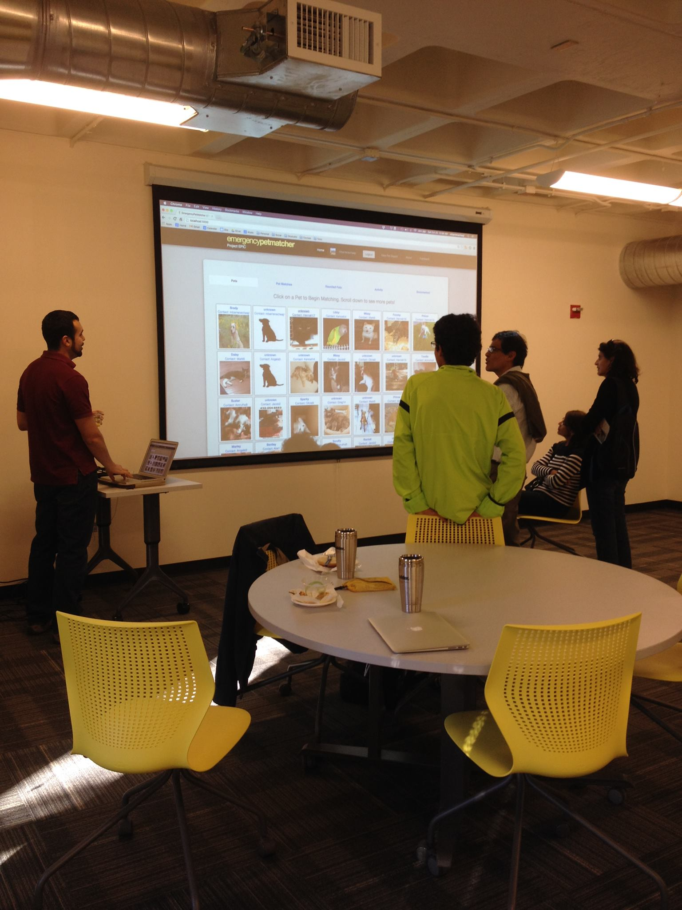

# Personal Information

## Name
Mario Barrenechea

## Email
<a href="mailto:Mario.Barrenechea@Colorado.EDU">Mario.barrenechea@colorado.edu</a>

## Photo
</img>

## Website
[www.mbarrenecheajr.com](http://www.mbarrenecheajr.com)

# Current Funding
Yes. Ken Anderson et al. Project EPIC grant. Contract signed through May 2013 as an RA.

# PhD Program

## Thesis Advisor
Ken Anderson

## Committee
* Ken Anderson
* Leysia Palen
* Evan Chang

## Milestones

| Milestone            | Completed         | Planned           |         
| -------------------- | ----------------- | ----------------- |
| Start                | Fall 2011 		|                   |
| Area Exam            | Fall 2013			 | 	 |
| Proposal Defense     | TBD| Spring 2015 |
| Dissertation Defense | TBD | Fall 2015|

## Courses

| Course           | Taken             | Planned            | Depth    | Breadth | 
| ---------------- | ----------------- | ------------------ | -------- | ------- |
| CSCI 6000 Introduction to PhD | Fall 2011 |   | No | No|
| CSCI 5535 Fundamental Concepts of Programming Languages | Fall 2011 | | No | Yes|
| CSCI 5448 Object-Oriented Analysis and Design | Fall 2011 |  | Yes | No|
| CSCI 5828 Foundations of Software Engineering | Spring 2012 |  | Yes | No |
| CSCI 5454 Analysis and Design of Algorithms | Spring 2012 | | No | Yes|
| CSCI 7000 CHI Student Design Competition Studio | Spring 2012 |  | No | No|
| CSCI 7000 Foundations of Cyber-Physical Systems | Fall 2012 |  | No | Yes|
| CSCI 7000 Datacenter Scale Computing | Fall 2012 |  | No | Yes|
| CSCI 7154 Readings in Formal Methods | Fall 2012 |  | No | Yes|
| CSCI 7135 Program Analysis| Spring 2013 |  | No | Yes|
| CSCI 5919 HCI Survey and Synthesis | Fall 2013 |  | Yes | No|
| CSCI 7000 Social Computing | Spring 2014 |  | Yes | No|

# Research

## Publications

* Soden, R., Anderson, T. J., Palen, L., Barrenechea, M. (2015). <a href="papers/osm.pdf">Open Data Dreams in a Time-Critical Reality: The Evolution of OpenStreetMap in Response to Humanitarian Events</a>. In proceedings of the SIGCHI conference on human factors in computing systems (CHI). In Submission.

* Barrenechea, M., Anderson, K. M., Palen, L., White, J. (2015). <a href="papers/epm-crowdwork.pdf">Engineering Crowdwork for Disaster Events: The Human-Centered Development of a Lost-and-Found Tasking Environment.</a> Proceedings of the 48th annual Hawaiian international conference on system science (HICSS). In Press.

* Anderson, K. M., Aydin, A. A., Barrenechea, M., Cardenas, A., Hakeem, M., Jambi, S. (2015). <a href="papers/epic-analyze.pdf">Design Challenges/Solutions for Environments Supporting the Analysis of Social Media Data in Crisis Informatics Research</a>. Proceedings of the 48th annual Hawaiian international conference on system science (HICSS). In Press.

* Barrenechea, M. (2015). <a href="papers/boaster.pdf"> Mobile Software During Disaster Events: A Motivational Discussion</a>. Boasters of the 2014 Human-Computer Interaction Consortium (HCIC). Watsonville, CA.

* Barrenechea, M., Barron, J.,  and  White, J. (2012).<a href="papers/noplacelikehome.pdf"> No Place Like Home: Pet-to-Family Reunification After Disaster</a>. Proceedings of the 2012 ACM annual conference extended abstracts on Human Factors in Computing Systems. Retrieved from http://dl.acm.org/citation.cfm?id=2212433

## Presentations

* Barrenechea, M. (September 2014). <a href="presentations/epic-gem.pdf">EPIC-Dev-Gem.</a> Presented to the EPIC Analyze Team.
* Barrenechea, M. (February 2014). <a href="presentations/epic-analyze.pdf"> EPIC Analyze. </a> Presented to the EPIC grant team.
* Barrenechea, M. (May 2013). <a href="presentations/icse2013.pdf">A Look into #icse2013 - Experiences, Trends, and People.</a> Presented to EPIC SE team.
* Barrenechea, M. (January 2013). <a href="presentations/epm-engineering.pdf">Engineering for Disaster Management: A Human-centered Software Process for Designing and Developing Interactive Systems for Mass Emergency Events.</a> CUBoulder Department of Computer Science Graduate Student Colloquium.
* Barrenechea, M. (October 2012). EmergencyPetMatcher demonstration to the Project EPIC team.
* Barrenechea, M. (September 2012). <a href="presentations/cs.pdf">Speaking in Judy Stafford's Freshmen Engineering Seminar.</a>
      
## Awards

* NSF Graduate Research Fellowship 2012: Honorable Mention based on recommendation letters, essays, and academic performance.
* 2012 ACM SIGCHI Student Design Competition - Finalist

# Teaching

* TA-ed CSCI 3308 - Software Methods and Tools with instructor Elizabeth White in Fall 2011.
* TA-ed CSCI 1300 - Introduction to Programming with instructor Dmitry Duplyakin in Spring 2012.

# Service

* Social Committee member as of Fall 2014.
* Organized HCC community to clean out DLC conference room.

# Highlights

## Rockin’ it at the Rocky Mountain Celebration of Women in Computing Conference (Fall 2012).

</img>

## @ICSE2013 in San Francisco, CA (Spring 2013).

</img>

## Representing CUBoulder Pride at ACM SIGCHI (Spring 2012).

</img>

## Talking to Engineering Alumni @ CUBoulder Engineering Alum Event (October 2014)

</img>

## Organize HCC students to clean up this room and turn it into a conference room in DLC 170 (Fall 2013).

</img>

